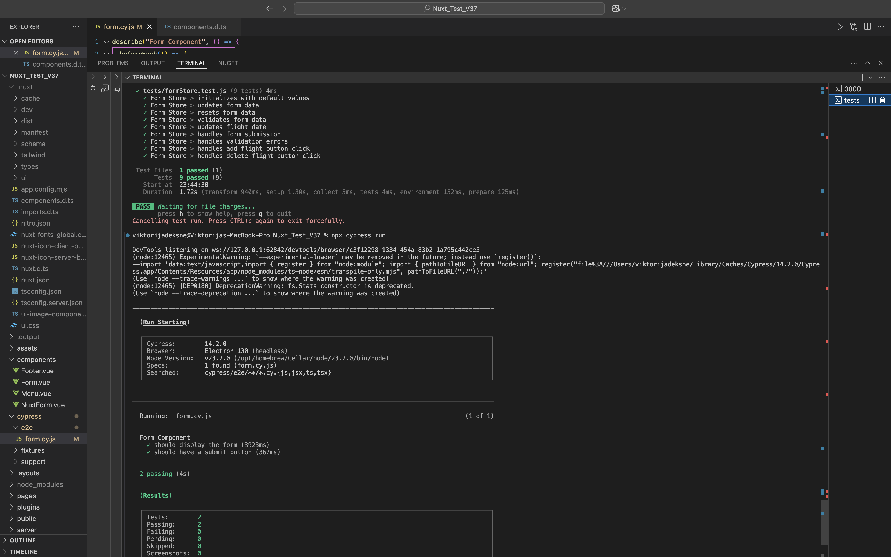

### Nuxt 3 website

This project was built with:

- **Nuxt 3**
- **Pinia**
- **Vitest**
- **Cypress**


A few inital tests were executed to test the functionality of the website. The tests were written using vitest and Cypress testing frameworks.



## Setup

To set up the project, follow these steps:

1. Install dependencies:

   ```sh
   pnpm install
   ```

2. Run the development server:

   ```sh
   pnpm run dev
   ```

3. Run the tests:

   ```sh
   pnpm vitest
   ```

4. Run the Cypress tests:

   ```sh
   pnpm run cypress:open
   ```
